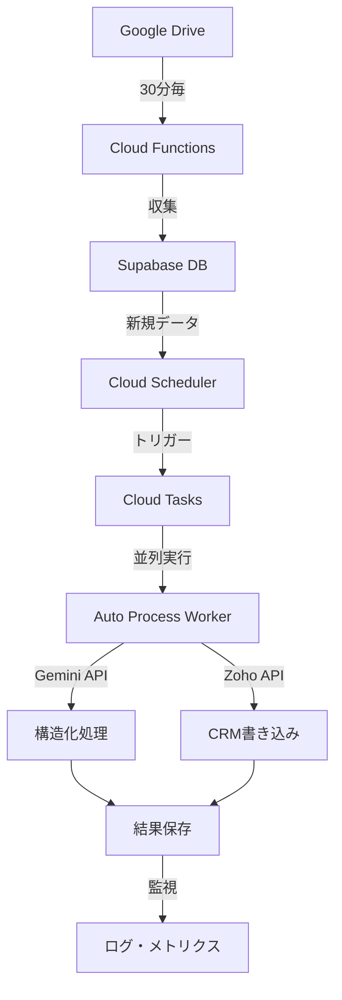

# 📋 自動構造化処理システム - 実装要件定義書

### 🎯 **システム概要**
既存の1000件以上の議事録データと継続的に増加する新規データ（30分毎収集）に対して、効率的な自動構造化処理を実現するシステム

---

## 🔧 **機能要件**

### 1. 並列処理機能
**FR-001**: 会議データの並列処理
- **目的**: 処理時間の大幅短縮（現状の3-5倍高速化）
- **仕様**: ThreadPoolExecutorを使用した並列実行
- **設定**: `AUTOPROC_PARALLEL_WORKERS=5`（同時処理数）
- **制約**: Cloud Run 15分タイムアウト内での完了保証

**FR-002**: バッチサイズ制御
- **目的**: タイムアウト回避と安定処理
- **仕様**: `AUTOPROC_BATCH_SIZE=10`（1回あたり処理件数を20→10に削減）
- **動作**: 並列度5 × バッチ10件 = 効率的処理

### 2. 優先度制御機能
**FR-003**: 処理優先度算出
```python
優先度スコア = (
    「初回」タイトル含有 × 10 +
    作成日時の新しさ × 5 +
    Zoho候補者一致可能性 × 8
)
```

**FR-004**: バックログ vs リアルタイム分離
- **バックログ処理**: 既存1000件の段階的処理（1日50-100件）
- **リアルタイム処理**: 30分毎収集データの即座処理（1-10件）

### 3. スケジュール管理機能
**FR-005**: Cloud Scheduler連携
- **バックログ処理**: `0 */2 * * *`（2時間毎）
- **リアルタイム処理**: `*/30 10-23 * * *`（営業時間30分毎）
- **メンテナンス**: `0 1 * * *`（深夜1時、統計更新）

---

## ⚡ **性能要件**

### NFR-001: 処理速度
- **目標**: 現状1.3件/分 → 3.3件/分（2.5倍向上）
- **制約**: Cloud Run 15分タイムアウト厳守
- **測定**: 処理完了時間のログ記録

### NFR-002: 可用性
- **目標**: 99.5%のシステム稼働率
- **障害時**: 自動リトライ機能（最大3回）
- **部分障害**: 1件失敗でも他件の処理継続

### NFR-003: スケーラビリティ
- **日次処理量**: 最大500件まで対応
- **同時処理**: 最大5並列まで安全動作
- **データ増加**: 月間1000件増加に対応

---

## 🛡️ **信頼性要件**

### NFR-004: エラーハンドリング
- **Gemini API障害**: フォールバックモデル自動切替
- **Zoho API障害**: 構造化処理のみ継続実行
- **ネットワーク障害**: 指数バックオフによるリトライ

### NFR-005: データ整合性
- **重複処理防止**: `structured_outputs`テーブルの存在チェック
- **トランザクション**: 構造化データ保存の原子性保証
- **ログ記録**: 全処理結果の監査ログ保存

---

## 💰 **コスト要件**

### NFR-006: API使用量制御
- **Gemini API**: 月間$100以内の使用量
- **モデル選択**: 文書サイズに応じた最適モデル選択
  - 軽量(<5000文字): `gemini-2.5-flash`
  - 標準(5000-15000文字): `gemini-2.5-pro`
  - 重量(>15000文字): 分割処理

### NFR-007: Cloud Run課金最適化
- **CPU使用時間**: 並列処理による30%削減目標
- **メモリ使用量**: 適切なリソース配分
- **アイドル時間**: 最小化による課金削減

---

## 📊 **監視要件**

### NFR-008: リアルタイム監視
- **処理成功率**: 90%以下でアラート発生
- **処理待ちキュー**: 50件超過でアラート
- **エラー率**: 5%超過でアラート
- **API使用量**: 月間予算80%でワーニング

### NFR-009: ログ・メトリクス
- **AI使用量ログ**: 全Gemini API呼び出しの記録
- **処理時間ログ**: 並列処理の効果測定
- **エラーログ**: 根本原因分析のための詳細記録

---

## 🔒 **セキュリティ要件**

### NFR-010: 認証・認可
- **Cloud Tasks**: OIDC認証による安全な呼び出し
- **Supabase**: RLS（Row Level Security）による適切なアクセス制御
- **API Keys**: Secret Manager使用（ハードコード禁止）

### NFR-011: データ保護
- **PII情報**: 議事録内の個人情報適切処理
- **API通信**: HTTPS必須、証明書検証
- **ログ**: 機密情報のマスキング

---

## 🚀 **運用要件**

### NFR-012: 導入・展開
- **段階的導入**: バックログ処理→リアルタイム処理の順次展開
- **ロールバック**: 問題発生時の即座復旧
- **設定変更**: 環境変数による動的調整

### NFR-013: 保守・運用
- **ヘルスチェック**: `/health`エンドポイント提供
- **設定調整**: 処理件数・並列度の運用時変更可能
- **統計レポート**: 日次・週次・月次の処理統計自動生成

---

## 📋 **技術仕様**

### 実装技術
- **言語**: Python 3.12
- **フレームワーク**: FastAPI
- **並列処理**: `concurrent.futures.ThreadPoolExecutor`
- **スケジューラ**: Google Cloud Scheduler
- **キューイング**: Google Cloud Tasks
- **データベース**: Supabase (PostgreSQL)
- **監視**: 独自ログシステム + Cloud Monitoring

### 環境変数
```bash
# 並列処理設定
AUTOPROC_PARALLEL_WORKERS=5
AUTOPROC_BATCH_SIZE=10

# 処理制御
AUTOPROC_MAX_ITEMS=10
CANDIDATE_TITLE_REGEX="初回.*(?P<name>[^\s-]+)"

# スケジュール
AUTOPROC_BACKLOG_SCHEDULE="0 */2 * * *"
AUTOPROC_REALTIME_SCHEDULE="*/30 10-23 * * *"

# 監視・アラート
AUTOPROC_SUCCESS_RATE_THRESHOLD=0.9
AUTOPROC_QUEUE_ALERT_THRESHOLD=50
```

### API エンドポイント
- `POST /api/v1/structured/auto-process` - 手動実行
- `POST /api/v1/structured/auto-process-task` - Cloud Tasks経由
- `POST /api/v1/structured/auto-process/worker` - Worker実行
- `GET /api/v1/structured/auto-process/stats` - 統計情報

### データフロー


---

## 📈 **期待効果**

### 処理能力向上
- **現状**: 20件/15分 (1.3件/分)
- **改善後**: 50件/15分 (3.3件/分) - **2.5倍向上**
- **日次処理**: 100-500件の安定処理

### コスト最適化
- **Gemini API**: 月$50-100の想定コスト
- **Cloud Run**: 処理時間短縮でCPU課金30%削減
- **運用工数**: 手動処理からの脱却で90%削減

### 運用安定性
- **エラー回復**: 自動リトライ・部分処理継続
- **拡張性**: 日間処理量500件まで対応可能
- **監視**: リアルタイム状況把握・予防保全

---

## 🚀 **実装フェーズ**

### Phase 1: 基盤並列化 (1-2日)
- [ ] ThreadPoolExecutor実装
- [ ] バッチサイズ調整
- [ ] 基本エラーハンドリング

### Phase 2: 運用最適化 (1週間)
- [ ] 優先度制御ロジック
- [ ] Cloud Scheduler設定
- [ ] 監視・ログ強化

### Phase 3: 高度な最適化 (2-3週間)
- [ ] 動的モデル選択
- [ ] キャッシュシステム
- [ ] 統計・レポート機能

### Phase 4: 運用自動化 (継続)
- [ ] アラート・通知システム
- [ ] 自動スケーリング
- [ ] SRE・運用自動化

---

この要件定義に基づいて、段階的な実装を進めることで、既存データと継続的データ増加に対応した安定的な自動処理システムを構築できます。